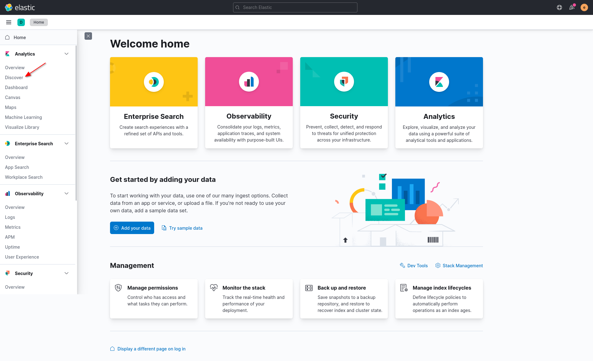
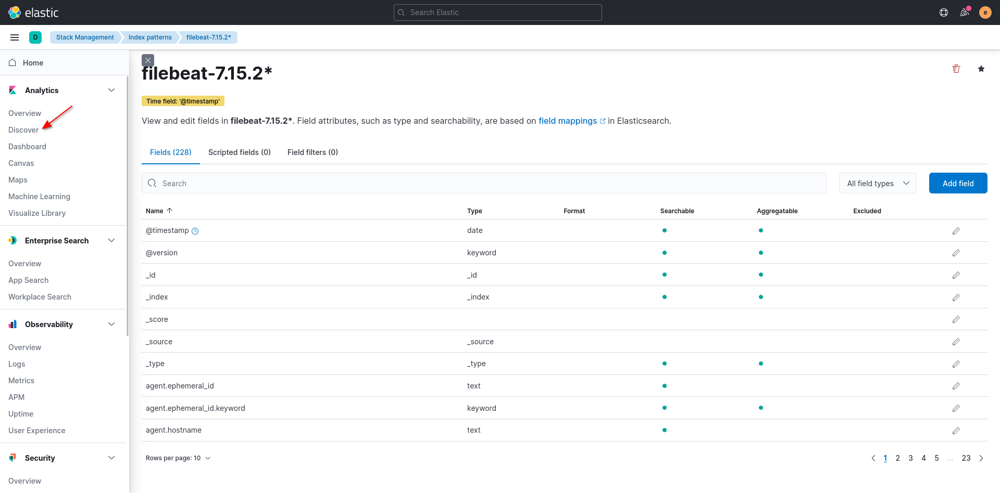

# Elastic Stack Cluster
Sample Elastic Stack Cluster

Thanks to,
- Myles Young (A Cloud Guru Instructor) for Elastic Stack Essentials and Elasticsearch Deep Dive courses
- Elastic official documentation and community

Steps:

- Set vm.max_map_count to 262144

    `sudo sysctl -w vm.max_map_count=262144`

- Clone the repository

    `git clone https://github.com/iamunnip/elastic-stack-cluster.git`

- Enter into docker directory
  
    `cd elastic-stack-cluster/docker`

- Change owner of filebeat.yml to root or uid (0)

    `sudo chown root filebeat.yml`

- Remove write permission from group and other users

    `sudo chmod go-w filebeat.yml`

- Generate certificates

    `docker-compose -f certs.yml run --rm certs`

- Deploy the stack

    `docker-compose up -d`

- Access kibana

    `https://localhost:5601`

    - username: elastic
    - password: elastic

- Once logged in, click discover option

    

- Click create index pattern

    

- Enter the index pattern name which matches the source and then select the @timestamp option from the dropdown menu. Once all done click create index pattern 
  
    - Name: filebeat-7.15.2*
    - Timestamp field: @timestamp

    

- Now the index pattern is created, click discover option

    

- Now we are able to see logs

    